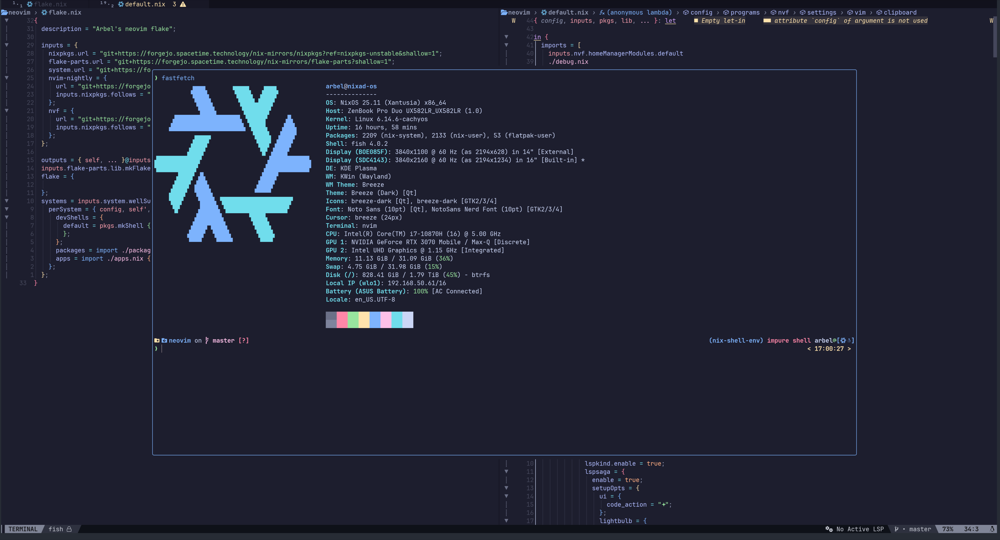
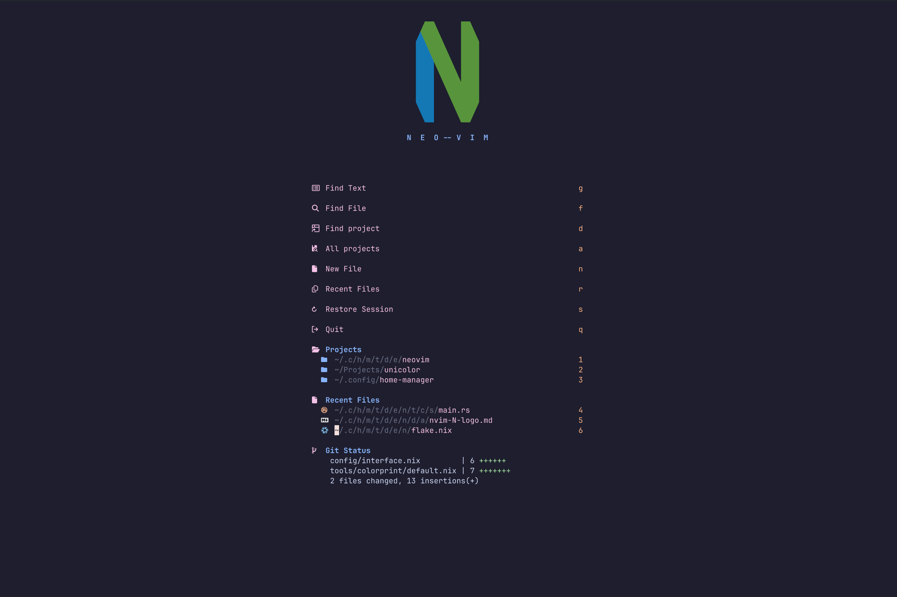
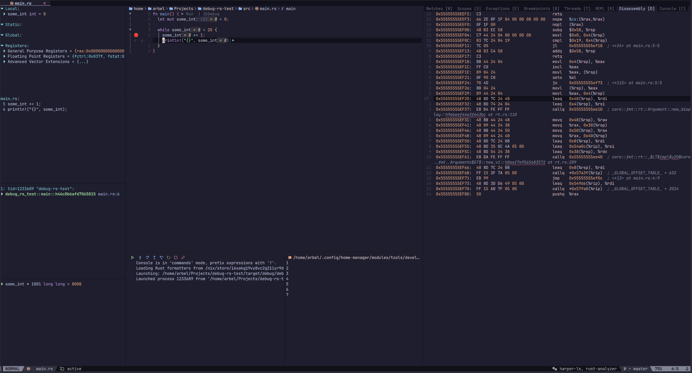

# Arbel's neovim flake

## Usage

```bash
nix run git+https://forgejo.spacetime.technology/arbel/nvim.nix
```

GUI version:

```bash
nix run git+https://forgejo.spacetime.technology/arbel/nvim.nix#gui
```

## [Language Support](./docs/languages.md)

## Screenshots

<div>



</div>

<div>



</div>

<div>



</div>

---

##### This project is based on [neovim](https://neovim.io) and [nvf](https://nvf.notashelf.dev/)

##### Licensed under the [GNU AGPLv3](./COPYING.md)
